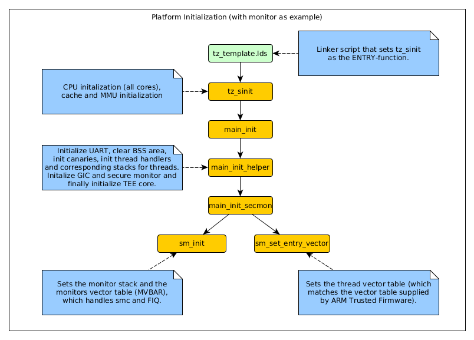
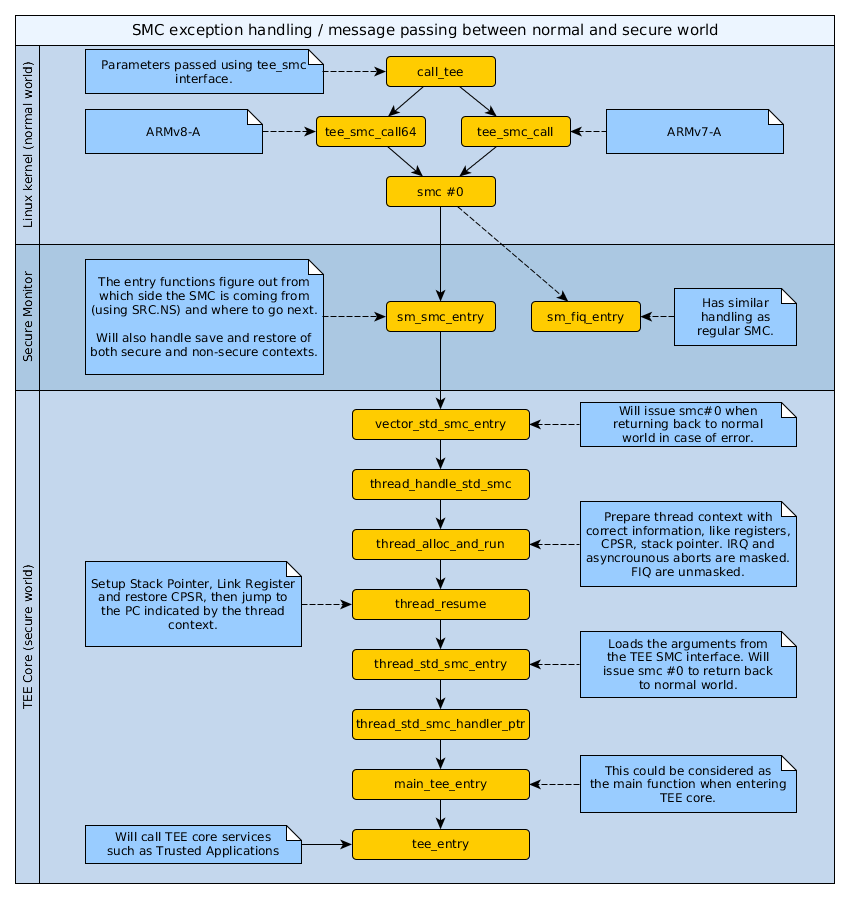
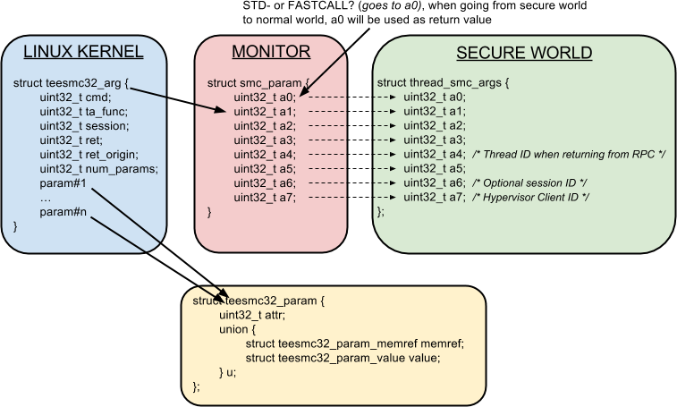

OP-TEE design
========================

# Contents

1.  Introduction
2.  Platform Initialization
3.  Secure Monitor Calls - SMC
    1. SMC handling
    2. TEE SMC Interface
    3. Communication using TEE SMC Interface
4.  Thread handling
5.  MMU
    1. Translation tables
    2. Translation tables and switching to normal world
6.  SVC
7.  Shared Memory
8.  Pager
9.  Cryptographic abstraction layer
10.  libutee
11. Trusted Applications

# 1. Introduction
OP-TEE is a so called Trusted Execution Environment, in short a TEE, for ARM
based chips supporting TrustZone technology. OP-TEE consists of three
components.

+ OP-TEE Client ([optee_client](https://github.com/OP-TEE/optee_client)), which
  is the client API running in normal world user space.
+ OP-TEE Linux Kernel device driver
  ([optee_linuxdriver](https://github.com/OP-TEE/optee_linuxdriver)), which is the
  device driver that handles the communication between normal world user space
  and secure world.
+ OP-TEE Trusted OS ([optee_os](https://github.com/OP-TEE/optee_os)), which is the
  Trusted OS running in secure world.
  
OP-TEE was designed with scalability and portability in mind and as of now it
has been ported to a handful of different platforms, both ARMv7-A and ARMv8-A
from different vendors 
(see
 [README.md](https://github.com/OP-TEE/optee_os/blob/master/README.md#platforms-supported)).

# 2. Platform initialization

When reading this section, please have a look at the illustration just below,
which would make it a bit easier to follow what is happening in the different
steps.

1. When the system boots up, the entry function, `tz_sinit`, specified in the
   linker script
   ([tz-template.lds](../core/arch/arm32/plat-stm/tz-template.lds)) will be
   called. This function will initialize all cores. Main setup is done using a
   single core and let the other cores wait until a certain point in the
   initialization phase has been reached, which then also will release the other
   cores. This function is also responsible of configuring the cache and set up
   the MMU.

2. During this phase the `main_init`, `main_init_helper` functions will be
   called for each core. These init functions are responsible of taking care of
   setting up the UART, clear the BSS section, setup canaries (used to find
   buffer overflows), initialize the GIC and register the monitor vector table.
   It is also in these functions where you are registering the thread handler.
   I.e, the handler that points to the functions to be called when you enter
   secure world.

# 3. Secure Monitor Calls - SMC
## 3.1 SMC handling
The communication between normal world and secure world is achieved using SMC
exceptions. During platform initialization (see the section about platform
initialization above) there is a vector table registered called the monitor
vector table. The way to register this is by writing to the register MVBAR. The
monitor vector table states the functions to be called when a SMC exception
occurs. In the current design the monitor is listening for two exceptions which
are regular SMC calls and FIQ requests ([see,
sm_vect_table in sm_asm.S](../core/arch/arm32/sm/sm_asm.S)).

The picture below shows and describes the main flow for a standard SMC call in
OP-TEE. 

1. Coming from normal world, this call is initiated in the TEE device
   driver in the Linux kernel. The first thing done is to put the parameter(s)
   according to the TEE SMC Interface and then generate the SMC exception by
   calling `smc #0`.

2. The exception will be trapped in the monitor which will do
   some bookkeeping and decide where to go next by looking at `SRC.NS` (by
   looking at SRC.NS we know which side we were coming from).
   
3. When it goes into secure world, the first thing that happens is that a thread
   will be assigned for the task. When that has been done the thread will
   start/resume from the PC stored in the context belonging to the thread. In
   the case when it is a standard call, the function `thread_alloc_and_run`
   ([thread.c](../core/arch/arm32/kernel/thread.c)) will be called. In this
   function the Trusted OS will try to find an unused thread for the new
   request. If there isn't any thread available (all existing threads already in
   use), then the Trusted OS will return back `TEESMC_RETURN_EBUSY`
   ([teesmc.h](../core/arch/arm32/include/sm/teesmc.h)) to the normal world. If
   an unused thread was found the Trusted OS will copy relevant registers,
   preparing the PC to jump to, namely the function `thread_std_smc_entry`. When
   all that has been done, the thread is prepared to be started.

4. When the thread is started (or resuming) the function `thread_std_smc_entry`
   ([thread_asm.S](../core/arch/arm32/kernel/thread_asm.S)) will be called,
   which in turn will call the `thread_stdcall_handler_ptr` that is pointing to
   the function used when registering the thread handlers. Normally this points
   to the `main_tee_entry` function
   ([entry.c](../core/arch/arm32/plat-vexpress/main.c)). But in case the
   platform we are intended to work with doesn't require any special handling
   one can ignore calling (and register this function) and instead directly call
   the generic `tee_entry` function.

5. `tee_entry` will call any of the pre-defined services in TEE core.

Below you will find a more detailed illustration of what will happen in the
different stages in the call flow. Pay attention to the function
`thread_std_smc_entry`, which is the location where we actually jump back to the
normal world (via the Secure Monitor).

## 3.2 TEE SMC Interface
TEE SMC Interface ([teesmc.h](../core/arch/arm32/include/sm/teesmc.h)) is the interface
used to communicate TEE related data between normal and secure world. The main
structure used for this communication is:

	struct teesmc32_arg {
	        uint32_t cmd;
	        uint32_t ta_func;
	        uint32_t session;
	        uint32_t ret;
	        uint32_t ret_origin;
	        uint32_t num_params;
	#if 0
	        /*
	         * Commented out elements used to visualize the layout dynamic part
	         * of the struct. Note that these fields are not available at all
	         * if num_params == 0.
	         *
	         * params is accessed through the macro TEESMC32_GET_PARAMS
	         */

	        struct teesmc32_param params[num_params];
	#endif
	}

* `cmd` is one of
	* `TEESMC_CMD_OPEN_SESSION`: Which is used when establishing a session
	   between normal and secure world.
	* `TEESMC_CMD_INVOKE_COMMAND`: Which is the main command used when
	   invoking functions in the Trusted OS and/or Trusted Applications.
	* `TEESMC_CMD_CLOSE_SESSION`: Used to close the session between normal
	   and secure world.
	* `TEESMC_CMD_CANCEL`: Used to cancel a pending command.
* `ta_func` is the function id for the specific function to be called within the
   Trusted Application. This is only used when `cmd` is
   `TEESMC_CMD_INVOKE_COMMAND` since the other commands never directly talk with
   the Trusted Applications.
* `session` is the TEE session that is shared between the both worlds. This
   variable will be initialized when opening a new session by calling
   `TEESMC_CMD_OPEN_SESSION`.
* `ret` is the return value either from the Trusted OS or the Trusted
   Application.
* `ret_origin` is the origin for the return value. This is a important
   information, since OP-TEE spans other  a couple of different layers (normal
   world user space, Linux kernel, Secure Monitor, Trusted OS and Trusted
   Applications).
* `num_params` tells how many parameters that has been provided and used by this
   structure.
* `params` all parameters are allocated at the end of the structure. There
   can be 0..n `num_params` allocated.

## 3.3 Communication using TEE SMC Interface
If we are looking into the source code, we could see that communication mainly
is achieved using `teesmc32_arg`, `smc_param` and `thread_smc_args`, where
`teesmc32_arg` could be seen as the main structure. What will happen is that the
[TEE driver](https://github.com/OP-TEE/optee_linuxdriver) will get the
parameters either from [normal world user
space](https://github.com/OP-TEE/optee_client) or directly from an internal
service in the Linux kernel. The TEE driver will populate the struct
`teesmc32_arg` with the parameters plus some additional bookkeeping information.
The secure monitor uses the smc_param structure, so just before issuing the SMC,
the kernel will assign the `teesmc32_arg` structure, setting whether it is a
std- or fastcall withing the `smc_param` structure. As the final step in the
TEE driver the SMC will be issued. The relation between the structures involved
has been illustrated below.

# 4. Thread handling
The Trusted OS uses a couple of threads to be able to support running jobs in
parallel (not fully enabled!). There are handlers for different purposes. In
[`thread.c`](../core/arch/arm32/kernel/thread.c) you will
find a function called `thread_init_handlers` which assigns handlers (functions)
that should be called when Trusted OS receives standard or fast calls, FIQ,
SVC and ABORT and even PSCI calls. These handlers are platform specific,
therefore this is something that needs to be implemented by each platform.

# 5. MMU
## Translation tables
OP-TEE uses several L1 translation tables, one large spanning 4 GiB and two
or more small tables spanning 32 MiB. The large translation table handles
kernel mode mapping and matches all addresses not covered by the small
translation tables. The small translation tables are assigned per thread
and covers the mapping of the virtual memory space for one TA context.

Memory space between small and large translation table is configured by
TTBRC. TTBR1 always points to the large translation table. TTBR0 points to
the a small translation table when user mapping is active and to the large
translation table when no user mapping is currently active.

The translation tables has certain alignment constraints, the alignment (of
the physical address) has to be the same as the size of the translation
table. The translation tables are statically allocated to avoid fragmentation of
memory due to the alignment constraints.

Each thread has one small L1 translation table of its own. Each TA context
has a compact representation of its L1 translation table. The compact
representation is used to initialize the thread specific L1 translation
table when the TA context is activated.

## Translation tables and switching to normal world
When switching to normal world either via an IRQ or RPC there's a chance
that secure world will resume execution on a different CPU. This means that
the new CPU need to be configured with the context of the currently active
TA. This is solved by always setting the TA context in the CPU when
resuming execution. Here's room for improvements since it's more likely
than not that it's the same CPU that resumes execution in secure world.

# 6. SVC
Will be written soon.

# 7. Shared Memory

Shared Memory is a block of memory that is shared between the non-secure
and the secure world. It is used to transfer data between both worlds.

## Shared Memory Allocation
The shared memory is allocated by the Linux driver from a pool
`struct shm_pool`. The pool contains:
* the physical address of the start of the pool
* the size of the pool
* whether or not the memory is cached
* list of chunk of memory allocated.

Note that
- the shared memory pool is physically contiguous.
- the shared memory area is not protected as it is used by both
  non-secure and secure world.

### Shared Memory Configuration
It is the Linux kernel driver for OP-TEE that is responsible for initializing
the shared memory pool,
given information provided by the Trusted OS. The Linux driver issues a SMC call
TEESMC32_OPTEE_FASTCALL_GET_SHM_CONFIG to retrieve the information
* physical address of the start of the pool
* size of the pool
* whether or not the memory is cached

The shared memory pool configuration is platform specific. The memory mapping,
including the area MEM_AREA_NSEC_SHM (shared memory with non-secure world), is
retrieved by calling the platform-specific function `bootcfg_get_memory()`.
Please refer to this function and the area type MEM_AREA_NSEC_SHM to see
the configuration for the platform of interest.

The Linux driver will then initialize the shared memory pool accordingly.

### Shared Memory Chunk Allocation
A chunk of shared memory consists of the start address of the chunk,
its size and also a reference counter. Right after the configuration of
the shared
memory pool, a unique chunk is created, being the whole shared memory
area, with a reference count set to 0.

Then a new chunk of memory is created on request. Chunk creation
consists of:
- Select the smallest free chunk (refcount==0) that fits size and
  alignment constraint.
- Allocation will fail if no such chunk could be found.
- Split the found chunk in order to create a memory chunk with given
  specification (size / alignment, and refcount=1), and create
  potentially 2 smaller empty chunks.

## Shared Memory Usage

### From the Client Application
The client application can ask for shared memory allocation using the Global
Platform Client API function TEEC_AllocateSharedMemory().

The client application can also provide shared memory through the
GlobalPlatform Client API function TEEC_RegisterSharedMemory(). In such a case,
the provided memory must be physically contiguous so that
the Trusted OS, that does not handle scatter-gather memory, is able to use
the provided range of memory addresses.

Note that the reference count of a shared memory chunk is incremented
when shared memory is registered, and initialized to 1 on allocation.

### From the Linux Driver
Occasionally the Linux kernel driver needs to allocate shared memory
for the communication with secure world, for example when
using buffers of type TEEC_TempMemoryReference.

### From the Trusted OS
In case the Trusted OS needs information from the TEE supplicant (dynamic
TA loading, REE time request,...), shared memory must be allocated.
Allocation depends on the use case.

The Trusted OS asks for the following shared memory allocation:
- `teesmc32_arg` structure, used to pass the arguments to the non-secure world,
  where the allocation will be done by sending a
  TEESMC_RPC_FUNC_ALLOC_ARG message
- In some cases, a payload might be needed for storing the result from
  TEE supplicant, for example when trying to get the REE time.
  This type of allocation will be done by sending the message
  TEESMC_OPTEE_RPC_FUNC_ALLOC_PAYLOAD, which then will return:
  - the physical address of the shared memory
  - a handle to the memory, that later on will be used later on
    when freeing this memory.

### From the TEE Supplicant
The TEE supplicant is also working with shared memory, used to exchange
data between normal and secure worlds. Two cases are considered:
- The TEE supplicant receives a memory address from the
  Trusted OS, used to store the data. This is for example the
  case when REE time is requested. In this case, the
  TEE supplicant must register the provided shared memory in the same
  way a client application would do, involving the Linux driver.
- The TEE supplicant provides a new shared memory that contains
  the result. This is the case when a Trusted Application is dynamically
  loaded. In this case, the TEE supplicant must allocate
  a shared memory in the same way a client application would do,
  involving the Linux driver.

# 8. Pager
Will be written soon.

# 9. Cryptographic abstraction layer
Cryptographic operations are implemented inside the TEE core by the
[LibTomCrypt](https://github.com/libtom/libtomcrypt) library. An abstraction
layer allows for replacing the default implementation, as explained in
[crypto.md](crypto.md).

# 10. libutee
Will be written soon.

# 11. Trusted Applications
Will be written soon.
### Initialize context
### Open Session
### Invoke command
### Close Session
### Finalize context

