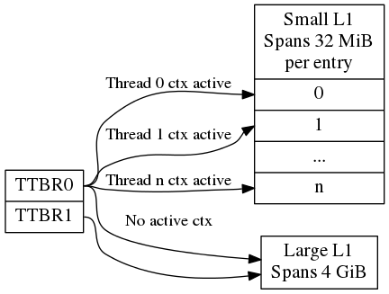

OP-TEE design
========================

# Contents

1.  [Introduction](#1-introduction)
2.  [Platform Initialization](#2-platform-initialization)
3.  [Secure Monitor Calls - SMC](#3-secure-monitor-calls---smc)
4.  [Thread handling](#4-thread-handling)
5.  [MMU](#5-mmu)
6.  [Stacks](#6-stacks)
7.  [Shared Memory](#7-shared-memory)
8.  [Pager](#8-pager)
9.  [Memory Objects](#9-memory-objects)
10. [Cryptographic abstraction layer](#10-cryptographic-abstraction-layer)
11. [libutee](#11-libutee)
12. [Trusted Applications](#12-trusted-applications)
13. [Device Tree support](#13-device-tree-support)

# 1. Introduction
OP-TEE is a so called Trusted Execution Environment, in short a TEE, for ARM
based chips supporting TrustZone technology. OP-TEE consists of three
components.

+ [OP-TEE Client], which is the client API running in normal world user space.
+ [OP-TEE Linux Kernel driver], which is the driver that handles the
  communication between normal world user space and secure world.
+ [OP-TEE Trusted OS], which is the Trusted OS running in secure world.
  
OP-TEE was designed with scalability and portability in mind and as of now it
has been ported to quite a few different platforms, both ARMv7-A and ARMv8-A
from different vendors. For a full list, please see [Platforms Supported].

OP-TEE OS is made of 2 main components: the OP-TEE core and a collection of
libraries designed for being used by Trusted Applications. While OP-TEE core
executes in the ARM CPU privileged level (also referred to as 'kernel land'),
the Trusted Applications execute in the non-privileged level (also referred to as
the 'userland'). The static libraries provided by the OP-TEE OS enable Trusted
Applications to call secure services executing at a more privileged level.

# 2. Platform initialization
TBD

# 3. Secure Monitor Calls - SMC
## 3.1 SMC handling
TBD

## 3.2 SMC Interface
The OP-TEE SMC interface is defined in two levels using [optee_smc.h] and
[optee_msg.h]. The former file defines SMC identifiers and what is passed in the
registers for each SMC. The latter file defines the OP-TEE Message protocol
which is not restricted to only SMC even if that currently is the only option
available.

## 3.3 Communication using SMC Interface
The main structure used for the SMC communication is defined in [struct
optee_msg_arg]. If we are looking into the source code, we could see that
communication mainly is achieved using `optee_msg_arg` and `thread_smc_args`,
where `optee_msg_arg` could be seen as the main structure. What will happen is
that the [OP-TEE Linux Kernel driver] will get the parameters either from
[OP-TEE Client] or directly from an internal service in the Linux kernel. The
TEE driver will populate the struct `optee_msg_arg` with the parameters plus
some additional bookkeeping information.  Parameters for the SMC are passed in
registers 1 to 7, register 0 holds the SMC id which among other things tells
whether it is a standard or a fast call.

# 4. Thread handling
The OP-TEE core uses a couple of threads to be able to support running jobs in
parallel (not fully enabled!). There are handlers for different purposes. In
[thread.c] you will find a function called `thread_init_primary` which assigns
`init_handlers` (functions) that should be called when OP-TEE core receives
standard or fast calls, FIQ and PSCI calls. There are default handlers for these
services, but the platform can decide if they want to implement their own
platform specific handlers instead.

## Synchronization
OP-TEE has three primitives for synchronization of threads and CPUs:
spin-lock, mutex, and condvar.

### Spin-lock
A spin-lock is represented as an `unsigned int`. This is the most primitive
lock. Interrupts should be disabled before attempting to take a spin-lock
and should remain disabled until the lock is released. A spin-lock is
initialized with `SPINLOCK_UNLOCK`.

| Function | Purpose |
|----------|---------|
| `cpu_spin_lock()` | Locks a spin-lock |
| `cpu_spin_trylock()` | Locks a spin-lock if unlocked and returns `0` else the spin-lock is unchanged and the function returns `!0`|
| `cpu_spin_unlock()` | Unlocks a spin-lock |

### Mutex
A mutex is represented by `struct mutex`. A mutex can be locked and
unlocked with interrupts enabled or disabled, but only from a normal
thread. A mutex cannot be used in an interrupt handler, abort handler or
before a thread has been selected for the CPU. A mutex is initialized with
either `MUTEX_INITIALIZER` or `mutex_init()`.

| Function | Purpose |
|----------|---------|
|`mutex_lock()` | Locks a mutex. If the mutex is unlocked this is a fast operation, else the function issues an RPC to wait in normal world. |
| `mutex_unlock()` | Unlocks a mutex. If there is no waiters this is a fast operation, else the function issues an RPC to wake up a waiter in normal world. |
| `mutex_trylock()` | Locks a mutex if unlocked and returns `true` else the mutex is unchanged and the function returns `false`. |
| `mutex_destroy()` | Asserts that the mutex is unlocked and there is no waiters, after this the memory used by the mutex can be freed. |

When a mutex is locked it is owned by the thread calling `mutex_lock()` or
`mutex_trylock()`, the mutex may only be unlocked by the thread owning the
mutex. A thread should not exit to TA user space when holding a mutex.

### Condvar
A condvar is represented by `struct condvar`. A condvar is similar to a
pthread_condvar_t in the pthreads standard, only less advanced. Condition
variables are used to wait for some condition to be fulfilled and are
always used together a mutex. Once a condition variable has been used
together with a certain mutex, it must only be used with that mutex until
destroyed. A condvar is initialized with `CONDVAR_INITIALIZER` or
`condvar_init()`.

| Function | Purpose |
|----------|---------|
| `condvar_wait()` | Atomically unlocks the supplied mutex and waits in normal world via an RPC for the condition variable to be signaled, when the function returns the mutex is locked again. |
| `condvar_signal()` | Wakes up one waiter of the condition variable (waiting in `condvar_wait()`) |
| `condvar_broadcast()` | Wake up all waiters of the condition variable. |

The caller of `condvar_signal()` or `condvar_broadcast()` should hold the
mutex associated with the condition variable to guarantee that a waiter
does not miss the signal.

# 5. MMU
## Translation tables
OP-TEE uses several L1 translation tables, one large spanning 4 GiB and two
or more small tables spanning 32 MiB. The large translation table handles
kernel mode mapping and matches all addresses not covered by the small
translation tables. The small translation tables are assigned per thread
and covers the mapping of the virtual memory space for one TA context.

Memory space between small and large translation table is configured by
TTBRC. TTBR1 always points to the large translation table. TTBR0 points to
the a small translation table when user mapping is active and to the large
translation table when no user mapping is currently active.

The translation tables has certain alignment constraints, the alignment (of
the physical address) has to be the same as the size of the translation
table. The translation tables are statically allocated to avoid fragmentation of
memory due to the alignment constraints.

Each thread has one small L1 translation table of its own. Each TA context
has a compact representation of its L1 translation table. The compact
representation is used to initialize the thread specific L1 translation
table when the TA context is activated.



## Translation tables and switching to user mode
This section only applies with `CFG_WITH_LPAE=n` and
`CFG_CORE_UNMAP_CORE_AT_EL0=y`.

When switching to user mode only a minimal kernel mode mapping is kept.
This is achieved by selecting a zeroed out big L1 translation in TTBR1 when
transitioning to user mode. When returning back to kernel mode the original
L1 translation table is restored in TTBR1.

## Translation tables and switching to normal world
When switching to normal world either via a foreign interrupt or RPC there
is a chance that secure world will resume execution on a different CPU.
This means that the new CPU need to be configured with the context of the
currently active TA. This is solved by always setting the TA context in
the CPU when resuming execution. Here is room for improvements since it is
more likely than not that it is the same CPU that resumes execution in
secure world.

# 6. Stacks
Different stacks are used during different stages. The stacks are:
- Secure monitor stack (128 bytes), bound to the CPU. Only available if
  OP-TEE is compiled with a secure monitor always the case if the target is
  ARMv7-A but never for ARMv8-A.
- Temp stack (small ~1KB), bound to the CPU. Used when transitioning from
  one state to another. Interrupts are always disabled when using this
  stack, aborts are fatal when using the temp stack.
- Abort stack (medium ~2KB), bound to the CPU. Used when trapping a data
  or pre-fetch abort. Aborts from user space are never fatal the TA is only
  killed. Aborts from kernel mode are used by the pager to do the demand
  paging, if pager is disabled all kernel mode aborts are fatal.
- Thread stack (large ~8KB), not bound to the CPU instead used by the current
  thread/task. Interrupts are usually enabled when using this stack.

*Notes for ARMv7/AArch32:*

| Stack  | Comment |
|--------|---------|
| Temp   | Assigned to `SP_SVC` during entry/exit, always assigned to `SP_IRQ` and `SP_FIQ` |
| Abort  | Always assigned to `SP_ABT` |
| Thread | Assigned to `SP_SVC` while a thread is active |

*Notes for AArch64:*
There are only two stack pointers, `SP_EL1` and `SP_EL0`, available for OP-TEE
in AArch64. When an exception is received stack pointer is always `SP_EL1` which
is used temporarily while assigning an appropriate stack pointer for `SP_EL0`.
**`SP_EL1` is always assigned the value of `thread_core_local[cpu_id]`.** This
structure has some spare space for temporary storage of registers and also keeps
the relevant stack pointers. In general when we talk about assigning a stack
pointer to the CPU below we mean `SP_EL0`.

## Boot
During early boot the CPU is configured with the temp stack which is used until
OP-TEE exits to normal world the first time.

*Notes for AArch64:*
`SPSEL` is always `0` on entry/exit to have `SP_EL0` acting as stack pointer.

## Normal entry
Each time OP-TEE is entered from normal world the temp stack is used as the
initial stack. For fast calls this is the only stack used. For normal calls an
empty thread slot is selected and the CPU switches to that stack.

## Normal exit
Normal exit occurs when a thread has finished its task and the thread is freed.
When the main thread function, tee_entry_std(), returns interrupts are disabled
and the CPU switches to the temp stack instead. The thread is freed and OP-TEE
exits to normal world.

## RPC exit
RPC exit occurs when OP-TEE need some service from normal world. RPC can
currently only be performed with a thread is in running state. RPC is initiated
with a call to thread_rpc() which saves the state in a way that when the thread
is restored it will continue at the next instruction as if this function did a
normal return. CPU switches to use the temp stack before returning to normal
world.

## Foreign interrupt exit
Foreign interrupt exit occurs when OP-TEE receives a foreign interrupt. For ARM
GICv2 mode, foreign interrupt is sent as IRQ which is always handled in normal
world. Foreign interrupt exit is similar to RPC exit but it is
`thread_irq_handler()` and `elx_irq()` (respectively for ARMv7-A/Aarch32 and
for Aarch64) that saves the thread state instead. The thread is resumed in the
same way though.
For ARM GICv3 mode, foreign interrupt is sent as FIQ which could be handled by
either secure world (EL3 in AArch64) or normal world. This mode is not supported
yet.

*Notes for ARMv7/AArch32:*
SP_IRQ is initialized to temp stack instead of a separate stack.  Prior to
exiting to normal world CPU state is changed to SVC and temp stack is selected.

*Notes for AArch64:*
`SP_EL0` is assigned temp stack and is selected during IRQ processing. The
original `SP_EL0` is saved in the thread context to be restored when resuming.

## Resume entry
OP-TEE is entered using the temp stack in the same way as for normal entry. The
thread to resume is looked up and the state is restored to resume execution. The
procedure to resume from an RPC exit or an foreign interrupt exit is exactly
the same.

## Syscall
Syscalls are executed using the thread stack.

*Notes for ARMv7/AArch32*:
Nothing special `SP_SVC` is already set with thread stack.

*Notes for syscall AArch64*:

Early in the exception processing the original `SP_EL0` is saved in `struct
thread_svc_regs` in case the TA is executed in AArch64.

Current thread stack is assigned to `SP_EL0` which is then selected.

When returning `SP_EL0` is assigned what is in `struct thread_svc_regs`. This
allows `tee_svc_sys_return_helper()` having the syscall exception handler return
directly to `thread_unwind_user_mode()`.

# 7. Shared Memory
Shared Memory is a block of memory that is shared between the non-secure and the
secure world. It is used to transfer data between both worlds.

## Shared Memory Allocation
The shared memory is allocated by the Linux driver from a pool `struct
shm_pool`, the pool contains:
* The physical address of the start of the pool
* The size of the pool
* Whether or not the memory is cached
* List of chunk of memory allocated.

Note that:
- The shared memory pool is physically contiguous.
- The shared memory area is not secure as it is used by both non-secure and
  secure world.

### Shared Memory Configuration
It is the Linux kernel driver for OP-TEE that is responsible for initializing
the shared memory pool, given information provided by the OP-TEE core. The Linux
driver issues a SMC call `OPTEE_SMC_GET_SHM_CONFIG` to retrieve the information
* Physical address of the start of the pool
* Size of the pool
* Whether or not the memory is cached

The shared memory pool configuration is platform specific. The memory mapping,
including the area `MEM_AREA_NSEC_SHM` (shared memory with non-secure world), is
retrieved by calling the platform-specific function `bootcfg_get_memory()`.
Please refer to this function and the area type `MEM_AREA_NSEC_SHM` to see the
configuration for the platform of interest. The Linux driver will then
initialize the shared memory pool accordingly.

### Shared Memory Chunk Allocation
It is the Linux kernel driver for OP-TEE that is responsible for allocating
chunks of shared memory. OP-TEE linux kernel driver relies on linux kernel
generic allocation support (`CONFIG_GENERIC_ALLOCATION`) to allocation/release
of shared memory physical chunks. OP-TEE linux kernel driver relies on linux
kernel dma-buf support (`CONFIG_DMA_SHARED_BUFFER`) to track shared memory
buffers references.

## Shared Memory Usage

### From the Client Application
The client application can ask for shared memory allocation using the
GlobalPlatform Client API function `TEEC_AllocateSharedMemory()`. The client
application can also provide shared memory through the GlobalPlatform Client API
function `TEEC_RegisterSharedMemory()`. In such a case, the provided memory must
be physically contiguous so that the OP-TEE core, that does not handle
scatter-gather memory, is able to use the provided range of memory addresses.
Note that the reference count of a shared memory chunk is incremented when
shared memory is registered, and initialized to 1 on allocation.

### From the Linux Driver
Occasionally the Linux kernel driver needs to allocate shared memory for the
communication with secure world, for example when using buffers of type
TEEC_TempMemoryReference.

### From the OP-TEE core
In case the OP-TEE core needs information from the TEE supplicant (dynamic TA
loading, REE time request,...), shared memory must be allocated. Allocation
depends on the use case. The OP-TEE core asks for the following shared memory
allocation:
- `optee_msg_arg` structure, used to pass the arguments to the non-secure world,
   where the allocation will be done by sending a `OPTEE_SMC_RPC_FUNC_ALLOC`
   message.
- In some cases, a payload might be needed for storing the result from TEE
  supplicant, for example when loading a Trusted Application. This type of
  allocation will be done by sending the message
  `OPTEE_MSG_RPC_CMD_SHM_ALLOC(OPTEE_MSG_RPC_SHM_TYPE_APPL,...)`, which then
  will return:
  - the physical address of the shared memory
  - a handle to the memory, that later on will be used later on when freeing
    this memory.

### From the TEE Supplicant
The TEE supplicant is also working with shared memory, used to exchange data
between normal and secure worlds. The TEE supplicant receives a memory address
from the OP-TEE core, used to store the data. This is for example the case when a
Trusted Application is loaded. In this case, the TEE supplicant must register
the provided shared memory in the same way a client application would do,
involving the Linux driver.

# 8. Pager
OP-TEE currently requires ~256 KiB RAM for OP-TEE kernel memory. This is not a
problem if OP-TEE uses TrustZone protected DDR, but for security reasons OP-TEE
may need to use TrustZone protected SRAM instead. The amount of available SRAM
varies between platforms, from just a few KiB up to over 512 KiB. Platforms with
just a few KiB of SRAM cannot be expected to be able to run a complete TEE
solution in SRAM. But those with 128 to 256 KiB of SRAM can be expected to have
a capable TEE solution in SRAM. The pager provides a solution to this by demand
paging parts of OP-TEE using virtual memory.

## Secure memory
TrustZone protected SRAM is generally considered more secure than TrustZone
protected DRAM as there is usually more attack vectors on DRAM. The attack
vectors are hardware dependent and can be different for different platforms.

## Backing store
TrustZone protected DRAM or in some cases non-secure DRAM is used as backing
store. The data in the backing store is integrity protected with one hash
(SHA-256) per page (4KiB). Readonly pages are not encrypted since the OP-TEE
binary itself is not encrypted.

## Partitioning of memory
The code that handles demand paging must always be available as it would
otherwise lead to deadlock. The virtual memory is partitioned as:

```
  Type      Sections
+--------------+-----------------+
|              | text            |
|              | rodata          |
|              | data            |
| unpaged      | bss             |
|              | heap1           |
|              | nozi            |
|              | heap2           |
+--------------+-----------------+
| init / paged | text_init       |
|              | rodata_init     |
+------------- +-----------------+
| paged        | text_pageable   |
|              | rodata_pageable |
+--------------+-----------------+
| demand alloc |                 |
|              |                 |
+--------------+-----------------+
```
Where "`nozi`" stands for "not zero initialized", this section contains entry
stacks (thread stack when TEE pager is not enabled) and translation tables (TEE
pager cached translation table when the pager is enabled and LPAE MMU is used).

The "`init`" area is available when OP-TEE is initializing and contains
everything that is needed to initialize the pager. After the pager has been
initialized this area will be used for demand paged instead.

The "`demand alloc`" area is a special area where the pages are allocated and
removed from the pager on demand. Those pages are returned when OP-TEE does not
need them any longer. The thread stacks currently belongs this area. This means
that when a stack is not used the physical pages can be used by the pager for
better performance.

The technique to gather code in the different area is based on compiling all
functions and data into separate sections. The unpaged text and rodata is then
gathered by linking all object files with `--gc-sections` to eliminate sections
that are outside the dependency graph of the entry functions for unpaged
functions. A script analyzes this ELF file and generates the bits of the final
link script. The process is repeated for init text and rodata.  What is not
"unpaged" or "init" becomes "paged".

## Partitioning of the binary

*Note: the struct definitions provided in this section are explicitly covered
by the following dual license:*
```
SPDX-License-Identifier: (BSD-2-Clause OR GPL-2.0)
```

The binary is partitioned into four parts as:
```
+----------+
| Header   |
+----------+
| Init     |
+----------+
| Hashes   |
+----------+
| Pageable |
+----------+
```
Header is defined as:
```c
#define OPTEE_MAGIC             0x4554504f
#define OPTEE_VERSION           1
#define OPTEE_ARCH_ARM32        0
#define OPTEE_ARCH_ARM64        1

struct optee_header {
        uint32_t magic;
        uint8_t version;
        uint8_t arch;
        uint16_t flags;
        uint32_t init_size;
        uint32_t init_load_addr_hi;
        uint32_t init_load_addr_lo;
        uint32_t init_mem_usage;
        uint32_t paged_size;
};
```

The header is only used by the loader of OP-TEE, not OP-TEE itself. To
initialize OP-TEE the loader loads the complete binary into memory and copies
what follows the header and the following `init_size` bytes to
`(init_load_addr_hi << 32 | init_load_addr_lo)`. `init_mem_usage` is used by the
loader to be able to check that there is enough physical memory available for
OP-TEE to be able to initialize at all. The loader supplies in `r0/x0` the
address of the first byte following what was not copied and jumps to the load
address to start OP-TEE.

In addition to overall binary with partitions inside described as above, extra
three binaries are generated simultaneously during build process for loaders
who support loading separate binaries:
```
+----------+
| Header   |
+----------+

+----------+
| Init     |
+----------+
| Hashes   |
+----------+

+----------+
| Pageable |
+----------+
```
In this case, loaders load header binary first to get image list and information
of each image; and then load each of them into specific load address assigned
in structure. These binaries are named with v2 suffix to distinguish from the
existing binaries. Header format is updated to help loaders loading binaries
efficiently:
```c
#define OPTEE_IMAGE_ID_PAGER    0
#define OPTEE_IMAGE_ID_PAGED    1

struct optee_image {
        uint32_t load_addr_hi;
        uint32_t load_addr_lo;
        uint32_t image_id;
        uint32_t size;
};

struct optee_header_v2 {
        uint32_t magic;
        uint8_t version;
        uint8_t arch;
        uint16_t flags;
        uint32_t nb_images;
        struct optee_image optee_image[];
};
```

Magic number and architecture are identical as original. Version is increased
to 2. `load_addr_hi` and `load_addr_lo` may be 0xFFFFFFFF for pageable binary
since pageable part may get loaded by loader into dynamic available position.
`image_id` indicates how loader handles current binary.
Loaders who don't support separate loading just ignore all v2 binaries.

## Initializing the pager
The pager is initialized as early as possible during boot in order to minimize
the "init" area. The global variable `tee_mm_vcore` describes the virtual memory
range that is covered by the level 2 translation table supplied to
`tee_pager_init()`.

### Assign pageable areas
A virtual memory range to be handled by the pager is registered with a call to
`tee_pager_add_core_area()`.

```c
bool tee_pager_add_area(tee_mm_entry_t *mm, uint32_t flags, const void *store,
			const void *hashes);
```

which takes a pointer to `tee_mm_entry_t` to tell the range, flags to tell how
memory should be mapped (readonly, execute etc), and pointers to backing store
and hashes of the pages.

### Assign physical pages
Physical SRAM pages are supplied by calling `tee_pager_add_pages()`

```c
void tee_pager_add_pages(tee_vaddr_t vaddr, size_t npages, bool unmap);
```

`tee_pager_add_pages()` takes the physical address stored in the entry mapping
the virtual address "vaddr" and "npages" entries after that and uses it to map
new pages when needed. The unmap parameter tells whether the pages should be
unmapped immediately since they does not contain initialized data or be kept
mapped until they need to be recycled. The pages in the "init" area are supplied
with `unmap == false` since those page have valid content and are in use.

## Invocation
The pager is invoked as part of the abort handler. A pool of physical pages are
used to map different virtual addresses. When a new virtual address needs to be
mapped a free physical page is mapped at the new address, if a free physical
page cannot be found the oldest physical page is selected instead. When the page
is mapped new data is copied from backing store and the hash of the page is
verified. If it is OK the pager returns from the exception to resume the
execution.

## Paging of user TA

Paging of user TAs can optionally be enabled with CFG_PAGED_USER_TA=y.
Paging of user TAs is analogous to paging of OP-TEE kernel parts but with a
few differences:
- Read/write pages are paged in addition to read-only pages
- Page tables are managed dynamically

tee_pager_add_uta_area() is used to setup initial read/write mapping needed
when populating the TA. When the TA is fully populated and relocated
tee_pager_set_uta_area_attr() changes the mapping of the area to strict
permissions used when the TA is running.

# 9. Memory objects

A memory object, MOBJ, describes a piece of memory. The interface provided
is mostly abstract when it comes to using the MOBJ to populate translation
tables etc.

There is different kinds of MOBJs describing:
- physically contiguous memory
  - created with mobj_phys_alloc()
- virtual memory
  - one instance with the name mobj_virt available
  - spans the entire virtual address space
- physically contiguous memory allocated from a tee_mm_pool_t *
  - created with mobj_mm_alloc()
- paged memory
  - created with mobj_paged_alloc()
  - only contains the supplied size and makes mobj_is_paged() return true if
    supplied as argument
- secure copy paged shared memory
  - created with mobj_seccpy_shm_alloc()
  - makes mobj_is_paged() and mobj_is_secure() return true if supplied as
    argument

# 10. Cryptographic abstraction layer
Cryptographic operations are implemented inside the TEE core by the
[LibTomCrypt] library. An abstraction layer allows for replacing the default
implementation, as explained in [crypto.md].

# 11. libutee

The GlobalPlatform Core Internal API describes services that are provided to
Trusted Applications. libutee is a library that implements this API.

libutee is a static library the Trusted Applications shall statically link
against. Trusted Applications do execute in non-privileged secure userspace and
libutee also aims at being executed in the non-privileged secure userspace.

Some services for this API are fully statically implemented inside the
libutee library while some services for the API are implemented inside the
OP-TEE core (privileged level) and libutee calls such services through
system calls.

# 12. Trusted Applications

## Pseudo TAs and User Mode TAs

There are two ways to implement Trusted Applications (TAs), pseudo TAs and
user mode TAs. User mode TAs are full featured Trusted Applications as
specified by the GlobalPlatform TEE specifications, these are simply referred
to as 'Trusted Applications'. For most cases, user mode TAs are preferred.

### Pseudo Trusted Applications

These are implemented directly to the OP-TEE core tree in, eg,
`core/arch/arm/pta`, and are built along with and statically built into the
OP-TEE core blob.

The pseudo Trusted Applications included in OP-TEE already are OP-TEE
secure privileged level services hidden behind a "GlobalPlatform TA Client" API.
These pseudo-TAs are used for various purposes such as specific secure services
or embedded tests services.

Pseudo TAs do not benefit from the GlobalPlatform Core Internal API support
specified by the GlobalPlatform TEE specs. These APIs are provided to TAs as a
static library each TA shall link against (the "libutee") and that calls OP-TEE
core service through system calls. As OP-TEE core does not link with libutee,
Pseudo TAs can only use the OP-TEE core internal APIs and routines.

As pseudo TAs have the same privileged execution level as the OP-TEE core code
itself, such situation may not be desirable for complex TAs.

In most cases an unprivileged (user mode) TA is the best choice instead of adding
your code directly to the OP-TEE core.  However if you decide your application
is best handled directly in OP-TEE core like this, you can look at
`core/arch/arm/pta/stats.c` as a template and just add your pseudo TA based on
that to the `sub.mk` in the same directory.

### User Mode Trusted Applications

User Mode Trusted Applications are loaded (mapped into memory) by OP-TEE
core in the Secure World when something in the REE wants to talk to that
particular application UUID. They run at a lower CPU privilege level
than OP-TEE core code. In that respect, they are quite similar to regular
applications running in the Rich Execution Environment (REE), except that
they execute in Secure World.

Trusted Application benefit from the GlobalPlatform Core Internal API as
specified by the GlobalPlatform TEE specifications.

There are several types of user mode TAs, which differ by the way they are
stored.

#### "Normal" or Secure Storage Trusted Applications

These are stored in secure storage. The meta data is stored in a database
of all installed TAs and the actual binary is stored encrypted as a
separate file in the untrusted REE filesystem.

Before these TAs can be loaded they have to be installed first, this is
something that can be done during initial deployment or at a later stage.

For test purposes the test program xtest can install a TA into secure
storage with the command:
```
xtest --install-ta
```

#### "Legacy" or REE FS Trusted Applications

They consist of a cleartext signed ELF file, named from the UUID
of the TA and the suffix ".ta".

They are built separately from the OP-TEE core boot-time blob, although when
they are built they use the same build system, and are signed with the key
from the build of the original OP-TEE core blob.

Because the TAs are signed, they are able to be stored in the untrusted REE
filesystem, and `tee-supplicant` will take care of passing them to be checked
and loaded by the Secure World OP-TEE core.

#### Early Trusted Applications

The so-called early TAs are virtually identical to the normal (REE FS) TAs,
but insted of being loaded from the Normal World file system, they are linked
into a special data section in the TEE core blob. Therefore, they are available
even before `tee-supplicant` and the Normal World filesystems have come up.
More details in commit [early_tas].

## Special treatment of Trusted Applications

### Syscalls

User mode TAs are not directly bound to function exports in the OP-TEE
core blob, both because the TA code is kept at arm's length by executing at a
different privileged level, and because TAs direct binding to addresses in the
core would require upgrades of all TAs synchronusly with upgrades of the
OP-TEE core blob. Instead, the resolution of OP-TEE core exports in the TA
is done at runtime.

OP-TEE does this by using syscalls, the same kind of way as the Linux kernel
provides a stable API for its userland programs.  TAs are written to use
syscall wrappers to access functions exported from OP-TEE core, so this all
happens automatically when a TA wants to use an API exported from OP-TEE
core.

Pseudo TAs and anything else directly built into OP-TEE core do not
require going through a syscall interface, since they can just link directly
as they are directly part of the core.

Most of the services defined by the GlobalPlatform Core Internal API are
implemented through syscall from the TA to the OP-TEE core privileged level:
cryptographic services, communications with other TAs, ... Some services were
added through OP-TEE development such as ASCII message tracing.

Syscalls are provided already for all public exports from OP-TEE core that a
Dynamic TA is expected to use, so you only need to take care about this if
you will add new exported from OP-TEE core that TAs will want to use.

### Malloc mapping

The OP-TEE core code has its own private memory allocation heap that is mapped
into its MMU view only and cannot be seen by Trusted Applications.  The
core code uses `malloc()` and `free()` style APIs.

Trusted Applications also have their own private memory allocation heaps
that are visible to the owning TA, and to OP-TEE core. TAs manage their
heaps using `TEE_Malloc()` and `TEE_Free()` style apis.

Heap |Visible to   |Inaccessible to
-----|-------------|---------------
core |core         |any TA
TA   |core, same TA|any other TA

This enforces "Chinese Walls" between the TA views of Secure World.

Since OP-TEE core cannot perform allocations in the TA's private heap,
and the TA is not going to be able to access allocations from the OP-TEE
core heap, it means only allocations from the TA heap are visible to both the
TA and OP-TEE core.  When performing syscalls between a TA and OP-TEE core
then, the TA side must provide all the memory allocations for buffers, etc
used by both sides.

### Malloc pool

The OP-TEE core malloc heap is defined by `CFG_CORE_HEAP_SIZE` in `mk/config.mk`.

However for TAs, the individual TA TEE_Malloc() heap size is defined by
`TA_DATA_SIZE` in `user_ta_header_defines.h`.  Likewise the TA stack size is
set in the same file, in `TA_STACK_SIZE`.

## File format of a Dynamic Trusted Application

The format a TA is:
```
<Signed header>
<ELF>
```

Where `<ELF>` is the content of a standard ELF file and `<Signed header>`
consists of:

| Type | Name | Comment |
|------|------|---------|
| `uint32_t` | magic | Holds the magic number `0x4f545348` |
| `uint32_t` | img_type | image type, values defined by enum shdr_img_type |
| `uint32_t` | img_size | image size in bytes |
| `uint32_t` | algo | algorithm, defined by public key algorithms `TEE_ALG_*` from TEE Internal API specification |
| `uint16_t` | hash_size | size of the signed hash |
| `uint16_t` | sig_size | size of the signature |
| `uint8_t[hash_size]` | hash | Hash of the fields above and the `<ELF>` above |
| `uint8_t[sig_size]` | signature | Signature of hash |

# 13. Device Tree support

OP-TEE core can use the device tree format to inject platform configuration
information during platform initialization and possibly some run time contexts.

Device Tree technology allows to describe platforms from ASCII source files
so-called DTS files. These can be used to generate a platform description
binary image, so-called DTB, embedded in the platform boot media for
applying expected configuration settings during the platform initializations.

This scheme relaxes design constraints on the OP-TEE core implementation as
most of the platform specific hardware can be tuned without modifying C
source files or adding configuration directives in the build environments.

## Secure and Non-Secure Device Trees

There can be several device trees embedded in the target system and some
can be shared across the boot stages.

* Boot loader stages may load a device tree structure in memory for all boot
stage to get platform configuration from. If such device tree data are to be
accessed by the non-secure world, they shall be located in non-secure memory.

* Boot loader stages may load a device tree structure in secure memory for
the benefit of the secure world only. Such device tree blob shall be located
in secure memory.

* OP-TEE core can also embedded a device tree structure to describe the
platform.

* Non-secure world can embed a device tree structure and/or rely on a device
tree structure loaded by the secure world, being an early boot stage and/or
OP-TEE core.

Obviously the non-secure world will not be able to access a device tree
image located on a secure memory which non-secure world as no access to.

## Early boot device tree argument

The bootloader provides arguments to the OP-TEE core when it
boots it. Among those, the physical memory base address of a device tree
image accessible to OP-TEE core.

When OP-TEE core is built with `CFG_DT=y` this device tree is accessed by
OP-TEE core to get some information: console configuration, main memory
size.

OP-TEE will also try to add the description of the OP-TEE resources for
the non-secure world to properly communicate with OP-TEE. This assumes the
image is located in non-secure memory.

Modifications made by OP-TEE core on the non-secure device tree image provided
by early boot and passed to non-secure world are the following:
- Add an OP-TEE node if none found with the related invocation parameters.
- Add a reserved memory node for the few memory areas that shall be reserved
  to the secure world and non accessed by the non-secure world.
- Add a PSCI description node if none found.

Early boot DTB located in non-secure memory can be accessed by OP-TEE core
only during its initialization, before non-secure world boots.

## Early boot device tree overlay

There are two possibilities for OP-TEE core to provide a device tree
overlay to the non-secure world.

* Append OP-TEE nodes to an existing DTB overlay located at CFG_DT_ADDR or
  passed in arg2

* Generate a new DTB overlay at CFG_DT_ADDR if and only if CFG_DT_ADDR does
  not point to a valid DTB.

A subsequent boot stage should merge the OP-TEE DTB overlay into another
DTB.

A typical bootflow for this would be

ATF -> OP-TEE -> u-boot with u-boot merging the OP-TEE DTB overlay located
at CFG_DT_ADDR into a DTB u-boot has loaded from elsewhere.

This functionality is enabled when `CFG_EXTERNAL_DTB_OVERLAY=y`.

## Embedded Secure Device Tree

When OP-TEE core is built with configuration directive `CFG_EMBED_DTB=y`
directive `CFG_EMBED_DTB_SOURCE_FILE` shall provide the relative path of the
DTS file inside directory `core/arch/$(ARCH)/dts` from which a DTB is
generated and embedded in a read-only section of OP-TEE core.

In this case the device tree address passed to the OP-TEE entry point
by the bootloader is ignored, only the embedded device tree is accessible.

[crypto.md]: crypto.md
[early_tas]: https://github.com/OP-TEE/optee_os/commit/d0c636148b3a
[LibTomCrypt]: https://github.com/libtom/libtomcrypt
[OP-TEE Client]: https://github.com/OP-TEE/optee_client
[OP-TEE Linux Kernel driver]: https://github.com/linaro-swg/linux
[OP-TEE Trusted OS]: https://github.com/OP-TEE/optee_os
[optee_smc.h]: ../core/arch/arm/include/sm/optee_smc.h
[optee_msg.h]: ../core/include/optee_msg.h
[Platforms Supported]: https://github.com/OP-TEE/optee_os#3-platforms-supported
[struct optee_msg_arg]: ../core/include/optee_msg.h
[thread.c]: ../core/arch/arm/kernel/thread.c
